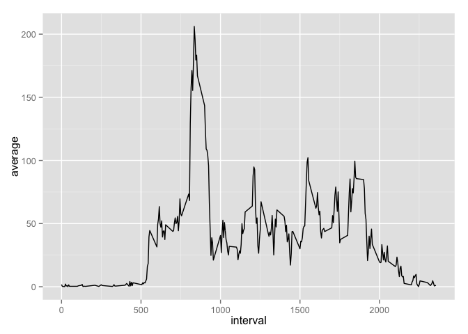
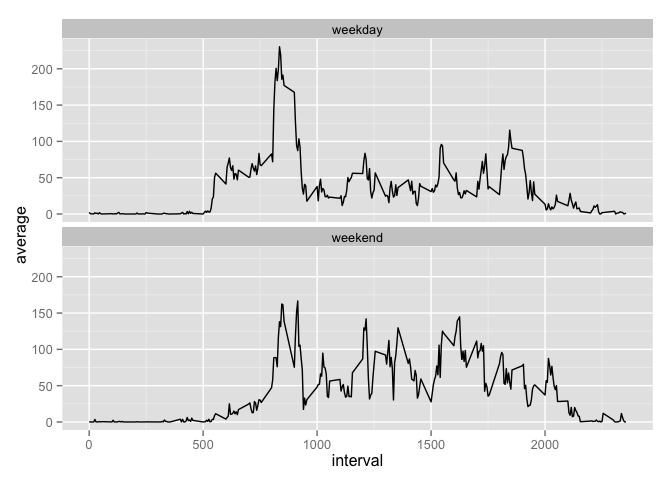

# Reproducible Research: Peer Assessment 1


## Loading and preprocessing the data

```r
setwd("~/data/coursera/5RR/week 2")
library(plyr); library(dplyr)
```

```
## 
## Attaching package: 'dplyr'
## 
## The following objects are masked from 'package:plyr':
## 
##     arrange, count, desc, failwith, id, mutate, rename, summarise,
##     summarize
## 
## The following object is masked from 'package:stats':
## 
##     filter
## 
## The following objects are masked from 'package:base':
## 
##     intersect, setdiff, setequal, union
```

```r
library(Hmisc)
```

```
## Loading required package: grid
## Loading required package: lattice
## Loading required package: survival
## Loading required package: splines
## Loading required package: Formula
## 
## Attaching package: 'Hmisc'
## 
## The following objects are masked from 'package:dplyr':
## 
##     src, summarize
## 
## The following objects are masked from 'package:plyr':
## 
##     is.discrete, summarize
## 
## The following objects are masked from 'package:base':
## 
##     format.pval, round.POSIXt, trunc.POSIXt, units
```

```r
dat0 <- read.csv("../week 2/activity.csv")
nrow(dat0)
```

```
## [1] 17568
```

```r
n_distinct(dat0$date)
```

```
## [1] 61
```


## What is mean total number of steps taken per day?
1.

```r
dat1 <- dat0 %>%
    filter(is.na(steps) == FALSE) %>%
    group_by(date) %>%
    mutate(sum = sum(steps))
dat2 <- dat1[!duplicated(dat1$sum),]
mean(dat2$sum)
```

```
## [1] 10766.19
```

```r
hist(dat2$sum)
```

 

2.

```r
summary(dat2$sum)[c(3,4)]
```

```
## Median   Mean 
##  10760  10770
```


## What is the average daily activity pattern?
1.

```r
dat3 <- dat0 %>%
    group_by(interval) %>%
    mutate(average = mean(steps, na.rm=T))
dat4 <- dat3[!duplicated(dat3$average),]
library(ggplot2)
ggplot(dat4, aes(x=interval, y=average)) + geom_line()
```

 

2.

```r
filter(dat4, average >200)[,3]
```

```
## Source: local data frame [1 x 1]
## Groups: interval
## 
##   interval
## 1      835
```


## Imputing missing values
1.

```r
dat5 <- na.omit(dat0)
nrow(dat0) - nrow(dat5)
```

```
## [1] 2304
```

2.

```r
dat6 <- as.data.frame(dat3)
for (i in 1:length(dat6[,1])) {
    if (is.na(dat6$steps[i]) == T) {
        dat6$steps[i] <- dat6$average[i]
    }
}
```

3.

```r
dat6 <- select(dat6, steps, date, interval)
```

4.

```r
dat7 <- dat6 %>%
    group_by(date) %>%
    mutate(sum = sum(steps))
dat8 <- dat7[!duplicated(dat7$sum),]
hist(dat8$sum)
```

 

```r
summary(dat8$sum)[c(3,4)]
```

```
## Median   Mean 
##  10770  10770
```
Answer: Yes


## Are there differences in activity patterns between weekdays and weekends?
1.

```r
dat6$date2 <- as.Date(dat6$date,"%Y-%m-%d")
dat6$day <- weekdays(dat6$date2)
dat6 <- as.data.frame(dat6)
for (i in 1:length(dat6[,1])) {
    if (dat6$day[i] %in% c("Saturday","Sunday")) {
        dat6$day2[i] <- "weekend"
    } else {
        dat6$day2[i] <- "weekday"
    }
}
```


2.

```r
dat7 <- dat6 %>%
    group_by(interval,day2) %>%
    mutate(average = mean(steps)) %>%
    select(date, interval, day2, average)
dat8 <- dat7[!duplicated(dat7[,c('interval','day2')]),]
ggplot(dat8, aes(x=interval, y=average)) + geom_line() + facet_wrap(~day2, nrow=2)
```

 
